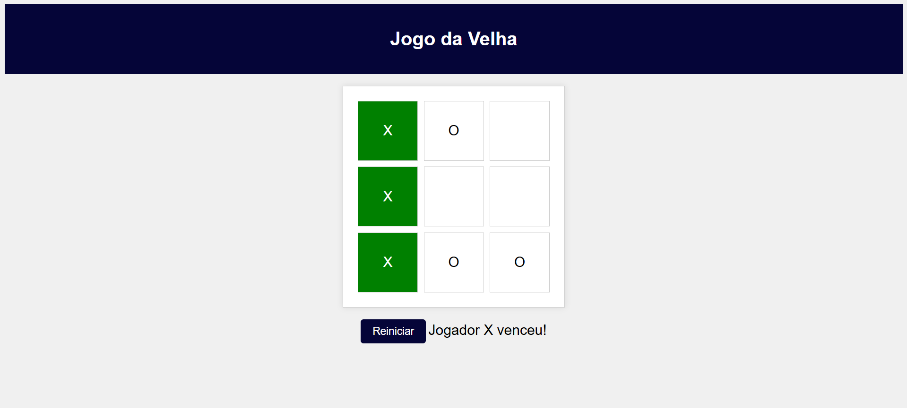

<h1 align="center">Jogo da velha</h1>

Jogo da velha desenvolvido para testar as habilidades em JS, HTML e CSS

  <a href="#-tecnologias">Tecnologia</a>&nbsp;&nbsp;&nbsp;|&nbsp;&nbsp;&nbsp;
  <a href="#-objetivo">Objetivo</a>&nbsp;&nbsp;&nbsp;|&nbsp;&nbsp;&nbsp;
  <a href="#memo-licença">Licença</a>

  

 

## 🚀 Tecnologias 

- JavaScript, HTML e CSS
- Git e Github 

## 🎯Objetivo

O objetivo era desenvolver um jogo da velha em que o usuário enfrentava a maquina.

## :memo: Licença

Esse projeto está sob a licença MIT.